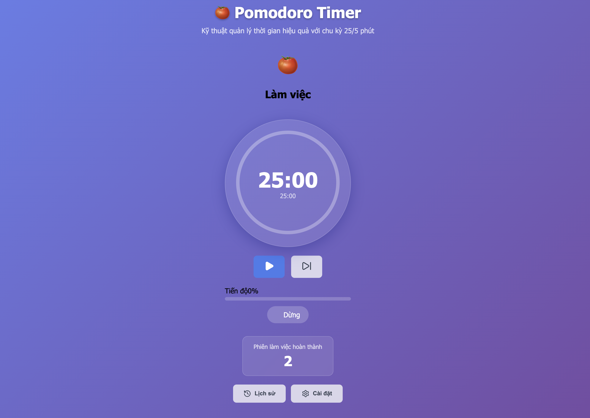
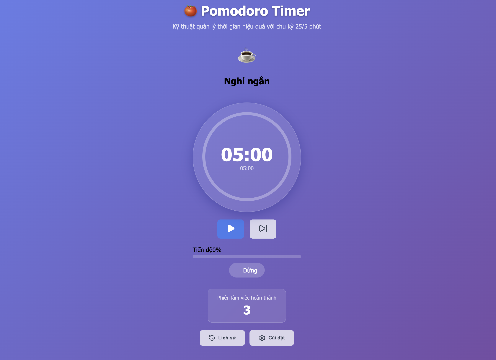
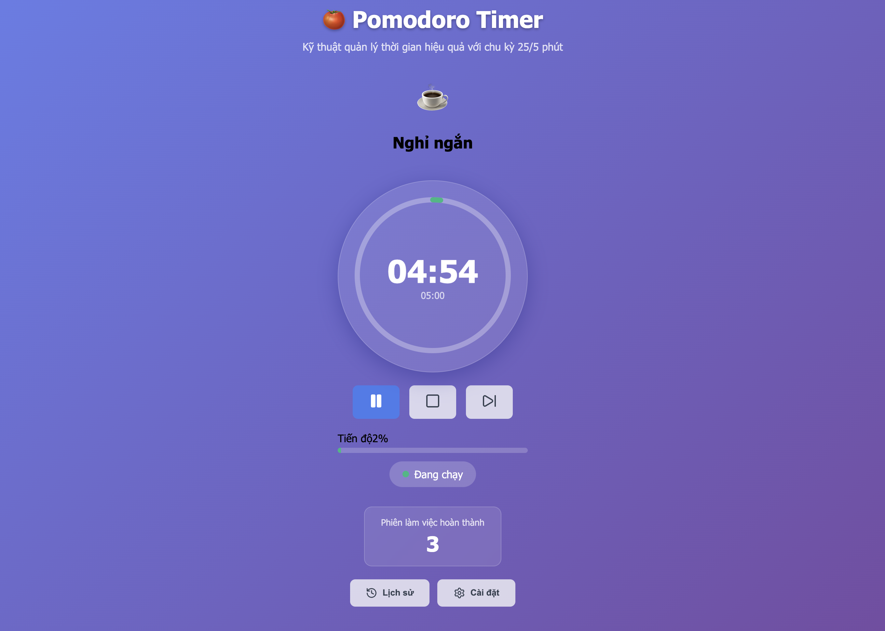
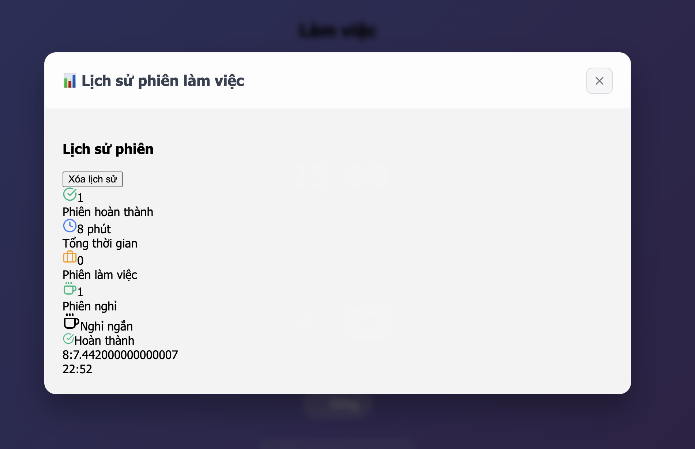
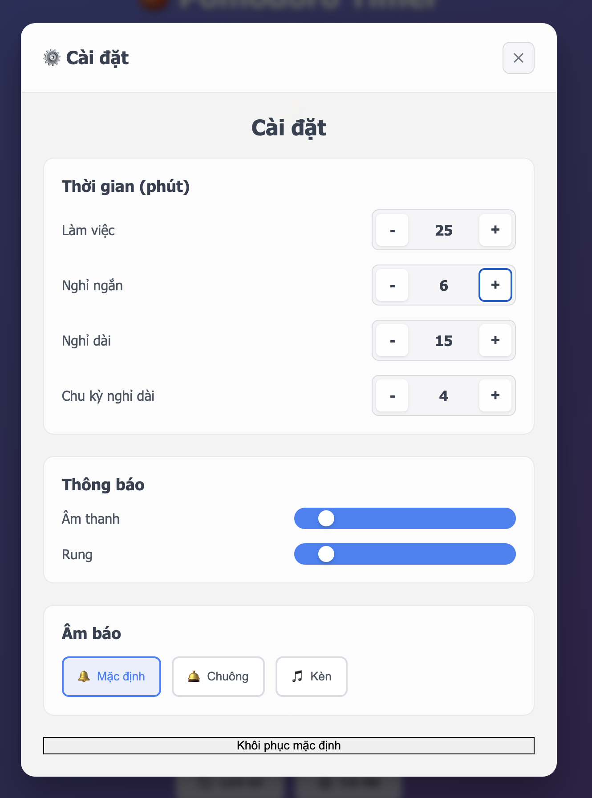

# 🍅 Pomodoro Timer App
Phan Thị Chi -- 22IT034 -- Phát triển ứng dụng di động đa nền tảng (1)GITTA
Ứng dụng Pomodoro Timer hiện đại được xây dựng với **React 19**, **TypeScript**, **Vite**, và **Capacitor** - hỗ trợ đầy đủ thông báo địa phương, rung, và hoạt động nền trên cả web và mobile.

## 🚀 Demo & Preview

- **Web App**: Chạy trực tiếp trên trình duyệt với đầy đủ tính năng
- **Mobile App**: Hỗ trợ iOS/Android thông qua Capacitor
- **PWA Ready**: Có thể cài đặt như ứng dụng native

## ✨ Tính năng chính

### 🎯 Yêu cầu cốt lõi
- ✅ **Chu kỳ Pomodoro chuẩn**: 25 phút làm việc, 5 phút nghỉ ngắn, 15 phút nghỉ dài
- ✅ **Hoạt động nền**: Timer tiếp tục đếm ngược khi app bị minimize hoặc chuyển tab
- ✅ **Thông báo thông minh**: Local notifications + haptic feedback + âm thanh tùy chỉnh
- ✅ **Dialog xác nhận**: Hiển thị popup khi phiên kết thúc với lựa chọn tiếp tục

### 🔥 Tính năng nâng cao
- ✅ **Lịch sử phiên chi tiết**: Lưu trữ và hiển thị tất cả phiên đã hoàn thành
- ✅ **Thống kê thông minh**: Số phiên hoàn thành, tổng thời gian làm việc hôm nay
- ✅ **Cài đặt linh hoạt**: Tùy chỉnh thời gian các phiên theo nhu cầu cá nhân
- ✅ **Âm thanh đa dạng**: Chọn từ nhiều âm báo khác nhau (bell, chime, ding)
- ✅ **Giao diện đẹp**: UI hiện đại với dark mode, circular progress, animations
- ✅ **Responsive Design**: Hoạt động mượt mà trên mọi thiết bị

## 🛠️ Công nghệ sử dụng

### Frontend Stack
- **React 19** - Library UI hiện đại nhất
- **TypeScript** - Type safety và developer experience tốt
- **Vite (Rolldown)** - Build tool siêu nhanh  
- **Tailwind CSS 4.x** - Utility-first CSS framework
- **Lucide React** - Icon library đẹp và nhẹ

### Mobile & Native Features
- **Capacitor** - Cross-platform native runtime
- **@capacitor/local-notifications** - Thông báo địa phương
- **@capacitor/haptics** - Rung hệ thống
- **@capacitor/dialog** - Native dialogs
- **@capacitor/app** - App lifecycle management

### UI Components
- **Radix UI** - Headless, accessible components
- **class-variance-authority** - Component variants
- **clsx & tailwind-merge** - Conditional styling

## 📁 Cấu trúc dự án

```
pomodoro/
├── 📄 capacitor.config.json      # Cấu hình Capacitor
├── 📄 package.json               # Dependencies và scripts
├── 📄 vite.config.ts            # Cấu hình Vite build tool
├── 📄 tailwind.config.js        # Cấu hình Tailwind CSS
├── 📄 tsconfig.json             # Cấu hình TypeScript
├── 📄 eslint.config.js          # Cấu hình ESLint
├── 📄 postcss.config.js         # Cấu hình PostCSS
├── 📄 index.html                # HTML entry point
│
├── 📁 public/                   # Static assets
│   ├── 🔊 sounds/              # Audio files cho notifications
│   │   ├── bell.mp3
│   │   ├── chime.mp3
│   │   └── ding.mp3
│   └── 🖼️ vite.svg
│
└── 📁 src/                     # Source code chính
    ├── 📄 main.tsx             # App entry point
    ├── 📄 App.tsx              # Root component
    ├── 📄 App.css              # Global styles
    ├── 📄 index.css            # Base CSS với Tailwind
    │
    ├── 📁 components/          # React components
    │   ├── 🎯 Timer.tsx        # Component timer chính với circular progress
    │   ├── ⚙️  Settings.tsx     # Component cài đặt thời gian và âm thanh
    │   ├── 📊 SessionHistory.tsx # Component lịch sử và thống kê
    │   └── 📁 ui/              # UI components tái sử dụng
    │       ├── button.tsx      # Button component với variants
    │       └── switch.tsx      # Toggle switch component
    │
    ├── 📁 hooks/               # Custom React hooks
    │   └── 🔄 usePomodoro.tsx  # Hook quản lý logic timer và state
    │
    ├── 📁 services/            # Business logic services
    │   └── 🔔 notifications.ts  # Service xử lý notifications, haptics, sounds
    │
    ├── 📁 lib/                 # Utility libraries
    │   ├── utils.ts            # Helper functions (cn, clsx)
    │   └── button-variants.ts  # Button styling variants
    │
    └── 📁 assets/              # Local assets
        └── react.svg
```

### 🧩 Kiến trúc components

#### 🎯 Timer.tsx
- **Mục đích**: Component timer chính với giao diện circular progress
- **Tính năng**: 
  - SVG circular progress bar với animation
  - Hiển thị thời gian còn lại
  - Buttons điều khiển (Start/Pause/Reset)
  - Hiển thị trạng thái phiên hiện tại

#### ⚙️ Settings.tsx  
- **Mục đích**: Cấu hình các tùy chọn của app
- **Tính năng**:
  - Chỉnh thời gian work/short break/long break
  - Bật/tắt notifications, haptics, dialog
  - Chọn âm thanh thông báo
  - Toggle switches với Radix UI

#### 📊 SessionHistory.tsx
- **Mục đích**: Hiển thị lịch sử và thống kê 
- **Tính năng**:
  - Stats cards (phiên hôm nay, tổng thời gian)
  - Danh sách sessions với thời gian hoàn thành
  - Auto-scroll với Radix ScrollArea

#### 🔄 usePomodoro.tsx (Hook)
- **Mục đích**: Quản lý toàn bộ logic timer và state
- **Tính năng**:
  - Timer countdown với setInterval
  - Session state management  
  - localStorage persistence
  - Background app handling với Capacitor
  - Auto-start next session

#### 🔔 notifications.ts (Service)
- **Mục đích**: Xử lý tất cả notifications và feedback
- **Tính năng**:
  - Local notifications với custom sounds
  - Haptic feedback cho mobile
  - Native dialogs với Capacitor
  - Web fallback cho các platforms không hỗ trợ

## 🚀 Cài đặt và chạy dự án

### Yêu cầu hệ thống
- **Node.js** >= 18.0.0
- **npm** hoặc **yarn** hoặc **pnpm**
- **Git** để clone repository

### 1️⃣ Clone repository

```bash
git clone https://github.com/chichiphan21/Pomodoro-Local-Notifications.git
cd Pomodoro-Local-Notifications
```

### 2️⃣ Cài đặt dependencies

```bash
# Sử dụng npm
npm install

# Hoặc yarn
yarn install

# Hoặc pnpm  
pnpm install
```

### 3️⃣ Thêm âm thanh (tùy chọn)

Tạo thư mục `public/sounds/` và thêm các file âm thanh:

```bash
mkdir -p public/sounds
# Thêm các file: bell.mp3, chime.mp3, ding.mp3
```

### 4️⃣ Chạy development server

```bash
npm run dev
```

App sẽ chạy tại `http://localhost:5173`

### 5️⃣ Build cho production

```bash
npm run build
```

## 📱 Triển khai Mobile App

### iOS App

```bash
# Cài đặt Capacitor iOS
npm install @capacitor/ios
npx cap add ios

# Sync code và build
npm run build
npx cap sync ios

# Mở Xcode để build và deploy
npx cap open ios
```

### Android App

```bash
# Cài đặt Capacitor Android  
npm install @capacitor/android
npx cap add android

# Sync code và build
npm run build
npx cap sync android

# Mở Android Studio
npx cap open android
```

## 🎮 Kết quả









## 🔧 Scripts có sẵn

```bash
# Development server với hot reload
npm run dev

# Build production với optimization
npm run build  

# Preview production build locally
npm run preview

# Lint code với ESLint
npm run lint

# Type check với TypeScript
npm run type-check
```

## 🌟 Tính năng nổi bật

### 🎨 Giao diện hiện đại
- **Circular Progress**: SVG-based với smooth animation
- **Dark Mode Ready**: Hỗ trợ theme tối sáng tự động
- **Responsive**: Hoạt động mượt từ mobile đến desktop
- **Micro-interactions**: Hover effects, transitions mềm mại

### 🔔 Thông báo thông minh  
- **Cross-platform**: Web notifications + native mobile notifications
- **Custom Sounds**: Nhiều lựa chọn âm thanh hoặc tắt hoàn toàn
- **Haptic Feedback**: Rung tùy chỉnh trên thiết bị hỗ trợ
- **Background Capable**: Hoạt động khi app không focus

### 💾 Lưu trữ dữ liệu
- **LocalStorage**: Tự động lưu settings và session history  
- **Persistent**: Data không mất khi refresh hoặc đóng app
- **Fast Loading**: Khôi phục state nhanh chóng khi mở lại

### ⚡ Performance tối ưu
- **Vite Build**: Build time siêu nhanh với Rolldown
- **Code Splitting**: Lazy loading components khi cần
- **Tree Shaking**: Loại bỏ code không sử dụng
- **Optimized Assets**: Minification và compression

## 🔍 Troubleshooting

### Thông báo không hoạt động
1. Kiểm tra browser permission cho notifications
2. Đảm bảo không ở chế độ "Do Not Disturb"  
3. Thử refresh page và cho phép notifications lại

### Âm thanh không phát
1. Kiểm tra volume hệ thống và browser
2. Đảm bảo các file .mp3 có trong `public/sounds/`
3. Thử các âm thanh khác trong settings

### App không hoạt động ở nền
1. Trên mobile: kiểm tra battery optimization settings
2. Trên web: đảm bảo tab không bị browser suspend
3. Capacitor apps: check background app refresh permissions

## 🤝 Đóng góp

Chúng tôi hoan nghênh mọi đóng góp! Hãy:

1. **Fork** repository này
2. **Tạo branch** cho feature mới (`git checkout -b feature/AmazingFeature`)
3. **Commit** changes (`git commit -m 'Add some AmazingFeature'`)
4. **Push** lên branch (`git push origin feature/AmazingFeature`)  
5. **Mở Pull Request**

## 📄 License

Dự án này được phân phối dưới **MIT License**. Xem file `LICENSE` để biết thêm chi tiết.

## 👨‍💻 Tác giả

**Chi Chi Phan** - [GitHub](https://github.com/chichiphan21)

---

⭐ **Nếu project này hữu ích, hãy cho một star nhé!** ⭐
